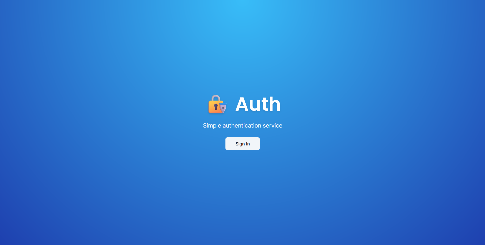

# Auth Full Class 🛡️



## About The Repository 📘

This repository contains a project that showcases the entire flow of authentication and authorization in Next.js, demonstrating best practices with TypeScript and Chakra-UI for a robust and scalable application.

## Features ✨

- **Complete Authentication Flow**: Sign up, sign in, sign out, and password recovery.
- **Authorization**: Role-based access control to protect resources.
- **Responsive Design**: Built with Chakra-UI for a responsive, mobile-first design.
- **TypeScript**: Strongly typed codebase to catch errors early.
- **Next.js**: SSR and SSG for faster page loads and SEO benefits.

## Technology Stack 🚀

- **Frontend & Backend**: Next.js
- **Others**: TypeScript, Shadcn-UI

## Installation 🛠️

1. Clone the repository

```git clone https://github.com/yourusername/auth-full-class.git```

2. Navigate to the project directory

```cd auth-full-class```

3. Install dependencies

```npm install```

4. Start the development server

```npm run dev```


## Usage 📖

1. Open your web browser and navigate to `http://localhost:3000`.
2. Explore the authentication flows: sign up, sign in, and access protected pages.

## Contributing 🤝

We welcome contributions to make this project even better! If you have suggestions or bug reports, please open an issue. For code contributions, please fork the repository and use a new branch for your changes. Don't forget to submit a pull request.

## License 📄

This project is licensed under the MIT License.
